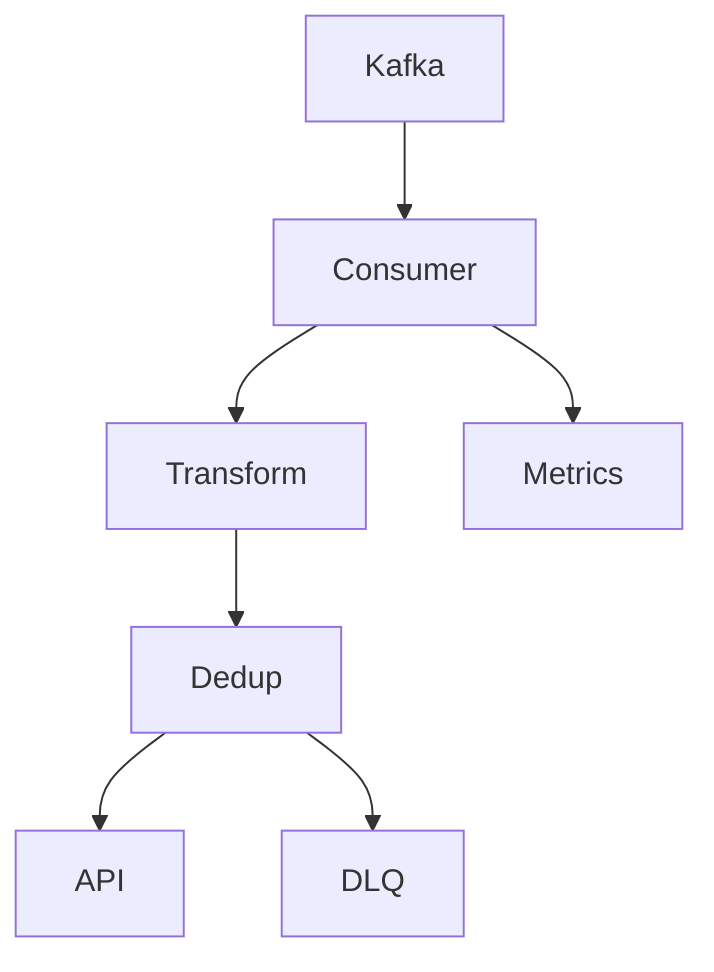

# Architecture

```mermaid
graph TD
    Kafka --> Consumer
    Consumer --> Transform
    Transform --> Dedup
    Dedup --> API
    Dedup --> DLQ
    Consumer --> Metrics
```

- Kafka via Redpanda (franz-go)
- Schema validation using JSON Schema
- Prometheus metrics
